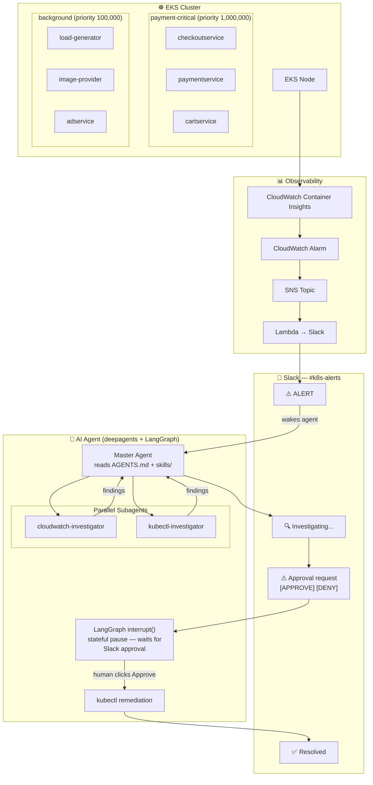

# K8s AI Agent Demo — NZ Tech Rally 2026

**Talk:** "AI Agents in Your Kubernetes Cluster: Troubleshooting at Scale, 24/7"  
**Conference:** NZ Tech Rally 2026 · May 15, Wellington  
**Speaker:** Dipin Thomas

> **Model compatibility note:** This agent has been tested with `openai:gpt-5.4-mini`.
> The `langchain-anthropic` package is listed in `requirements.txt` but Anthropic models
> have not been validated end-to-end. Use `AGENT_MODEL=openai:gpt-5.4-mini` for a
> known-working configuration.

---

## What This Is

An autonomous AI agent that monitors an EKS cluster, investigates incidents using
CloudWatch and the Kubernetes API in parallel via subagents, and asks for human
approval in Slack before taking any action that mutates cluster state.

The agent is **application-agnostic** — it is configured per deployment via:
- A **cluster skill** (`skills/clusters/<cluster-name>/SKILL.md`) describing the
  workloads, tiers, priority classes, and known characteristics of that cluster
- **Universal skills** (`skills/universal/`) describing investigation patterns that
  apply to any cluster (disk pressure, noisy neighbour, pod priority eviction,
  critical-service protection)

---

## Architecture



---

## Incident Lifecycle

1. CloudWatch alarm fires → message lands in the configured Slack channel
2. Agent acknowledges in the thread and decomposes the incident into a todo list
3. Subagents investigate in parallel:
   - **cloudwatch-investigator** — metrics, logs, alarm states
   - **kubectl-investigator** — node conditions, pod state, events (read-only)
4. Agent forms a hypothesis, gathers evidence, may revise as new data arrives
5. Agent posts findings to Slack, then issues an approval request with APPROVE / DENY buttons
6. Graph pauses at the destructive tool call (`interrupt_on`), holding state until the human responds
7. On APPROVE: tool executes, agent verifies recovery, writes resolution to memory
8. On DENY: agent acknowledges and stands down

---

## Repository Structure

```
.
├── AGENTS.md                          ← Agent identity (always loaded into LLM context)
├── CLAUDE.md                          ← Codebase documentation
├── BUILD.md                           ← Docker build and push instructions
│
├── agent/
│   ├── main.py                        ← Entry point (Flask + persistent event loop)
│   ├── agent.py                       ← Deep Agent construction
│   ├── subagents.py                   ← Subagent definitions
│   ├── middleware.py                  ← KeepLoopingMiddleware (loop control)
│   ├── optimization.py                ← Token cost middleware + tool output truncation
│   ├── requirements.txt
│   ├── Dockerfile
│   ├── .env.example
│   ├── tools/
│   │   ├── slack_tools.py             ← Slack post + approval-request tools
│   │   └── memory_tools.py            ← Save resolved incidents to memory
│   ├── mcp_servers/
│   │   ├── mcp_client.py              ← Loads tools from MCP servers
│   │   └── servers.yaml               ← MCP server URLs
│   ├── memory/
│   │   └── store.py                   ← Long-term memory store
│   └── evals/                         ← Agent evaluation framework
│       ├── judges.py
│       ├── metrics.py
│       └── runner.py
│
├── skills/
│   ├── universal/
│   │   ├── node-disk-pressure/        ← Generic disk-pressure playbook
│   │   ├── noisy-neighbor/            ← Generic CPU/memory contention playbook
│   │   ├── pod-priority-eviction/     ← Generic priority-based eviction logic
│   │   └── critical-service-protection/ ← Rules for protecting critical services
│   └── clusters/
│       └── <cluster-name>/SKILL.md    ← Per-deployment cluster skill (create your own)
│
├── infra/
│   ├── agent-deployment.yaml          ← Agent + RBAC manifest
│   ├── agent-secrets.example.yaml     ← Secrets template (copy → agent-secrets.yaml)
│   ├── mcp-gateway-deployment.yaml    ← MCP sidecar deployment
│   ├── mcp-gateway.Dockerfile         ← MCP gateway image
│   ├── redis-deployment.yaml          ← Redis checkpoint store
│   ├── priority-classes.yaml          ← K8s PriorityClass definitions
│   ├── cloudwatch-agent.yaml          ← Container Insights ConfigMap
│   └── cloudformation/
│       └── agent-iam.yaml             ← IRSA role for the agent ServiceAccount
│
└── slack/
    ├── bot-setup.md                   ← Slack app setup guide
    └── message-templates/             ← Example Slack Block Kit payloads
```

---

## Prerequisites

- AWS account with EKS, CloudWatch, and IAM permissions
- `aws`, `kubectl`, `docker` installed locally
- Slack workspace with a bot configured (see [slack/bot-setup.md](slack/bot-setup.md))
- Python 3.11+
- OpenAI API key

---

## Quick Start

### 1. Configure secrets

```bash
cp infra/agent-secrets.example.yaml infra/agent-secrets.yaml
# Fill in OPENAI_API_KEY, SLACK_BOT_TOKEN, SLACK_APP_TOKEN, etc.
kubectl apply -f infra/agent-secrets.yaml
```

### 2. Apply infrastructure manifests

```bash
# IRSA role (requires an existing EKS cluster + OIDC provider)
AWS_PROFILE=your-aws-profile aws cloudformation deploy \
  --template-file infra/cloudformation/agent-iam.yaml \
  --stack-name k8s-agent-iam \
  --capabilities CAPABILITY_NAMED_IAM

# Priority classes, Redis, MCP gateway, agent
kubectl apply -f infra/priority-classes.yaml
kubectl apply -f infra/redis-deployment.yaml
kubectl apply -f infra/mcp-gateway-deployment.yaml
kubectl apply -f infra/agent-deployment.yaml
```

### 3. Set environment variables

Key variables in `agent-secrets.yaml` (see `infra/agent-secrets.example.yaml` for the full list):

```bash
AGENT_MODEL=openai:gpt-5.4-mini   # tested and validated
OPENAI_API_KEY=sk-proj-...
SLACK_BOT_TOKEN=xoxb-...
SLACK_APP_TOKEN=xapp-...
SLACK_CHANNEL_ID=C...
CLUSTER_SKILL_PATH=./skills/clusters/<your-cluster>/SKILL.md
```

### 4. Create a cluster skill

Copy and fill in the template:

```bash
mkdir -p skills/clusters/<your-cluster>
# Create skills/clusters/<your-cluster>/SKILL.md
# See CLAUDE.md §7 for what to include
```

### 5. Trigger the agent (manual test)

```bash
curl -X POST http://<agent-service>/trigger \
  -H "Content-Type: application/json" \
  -d '{"alarm_name": "TestAlarm", "description": "Manual test trigger"}'
```

---

## Adapting to a New Cluster

1. Create `skills/clusters/<cluster-name>/SKILL.md` — describe workloads, service tiers,
   priority classes, healthy thresholds, and known incident patterns
2. Set `CLUSTER_SKILL_PATH` in `agent-secrets.yaml` to that file
3. Apply the priority classes from `infra/priority-classes.yaml` to the cluster
4. Configure CloudWatch alarms to route to the Slack channel via SNS → Lambda

The universal skills do not need to change — they describe patterns applicable to any
cluster; the cluster skill supplies the specifics.

---

## Key Concepts

| Agent Behaviour | Concept |
|---|---|
| Reads `AGENTS.md` on every investigation | Cluster identity layer |
| Loads cluster skill + universal skills | Progressive skill disclosure |
| Two subagents run in parallel | Parallel investigation |
| Calls kubectl + CloudWatch via MCP | Standardised tool protocol |
| Re-plans when hypotheses are wrong | Agent loop with `KeepLoopingMiddleware` |
| Pauses in Slack for human approval | LangGraph `interrupt_on` |
| Writes resolution to memory store | Long-term memory across incidents |

---

## References

- [Deep Agents docs](https://docs.langchain.com/oss/python/deepagents/overview)
- [MCP spec](https://modelcontextprotocol.io)
- [LangGraph human-in-the-loop](https://langchain-ai.github.io/langgraph/concepts/human_in_the_loop/)
- [AWS CloudWatch Container Insights for EKS](https://docs.aws.amazon.com/AmazonCloudWatch/latest/monitoring/Container-Insights-setup-EKS-quickstart.html)
- [Previous talk (LangGraph 3-node)](https://github.com/dipinthomas/langraph_3node_agent)
- [NZ Tech Rally](https://nztechrally.nz)
