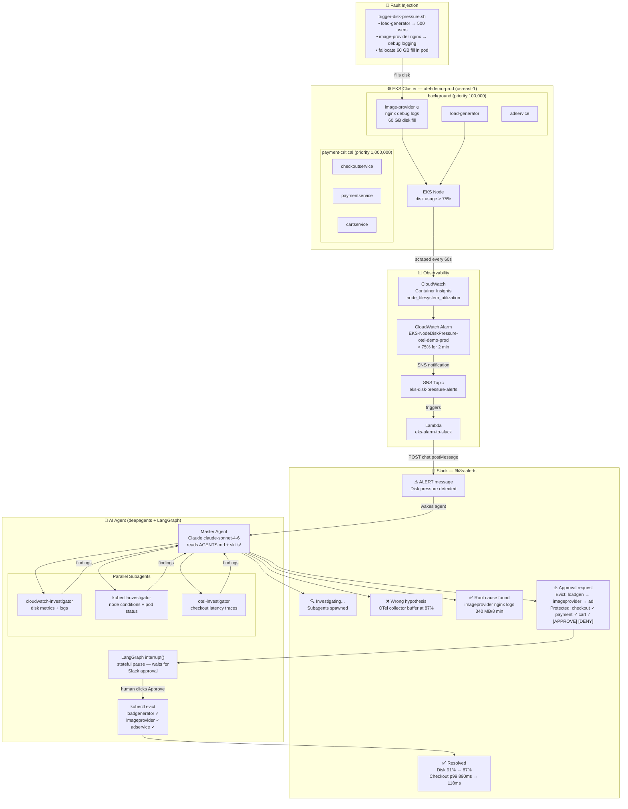

# K8s AI Agent Demo — NZ Tech Rally 2026

**Talk:** "AI Agents in Your Kubernetes Cluster: Troubleshooting at Scale, 24/7"  
**Conference:** NZ Tech Rally 2026 · May 15, Wellington  
**Speaker:** Dipin Thomas

---

## Architecture



---

## What This Is

A fully working AI agent demo that monitors an EKS cluster, autonomously investigates
a disk pressure incident, and asks for human approval via Slack before evicting pods.

The agent:
1. Receives a CloudWatch alarm via Slack
2. Spawns parallel subagents (CloudWatch + kubectl + OTel traces)
3. Pursues a wrong hypothesis first, then self-corrects (intentional — shows real reasoning)
4. Posts evidence to Slack and asks for approval
5. Executes evictions after human approval
6. Posts a resolution summary

---

## Prerequisites

- AWS account with EKS, CloudWatch, and IAM permissions
- `eksctl`, `kubectl`, `helm`, `aws` CLI installed
- Slack workspace with bot creation permissions
- Python 3.11+
- Anthropic API key

---

## Quick Start

### 1. Deploy EKS Cluster

```bash
eksctl create cluster \
  --name otel-demo-prod \
  --region us-east-1 \
  --nodegroup-name standard-workers \
  --node-type m5.2xlarge \
  --nodes 3 \
  --nodes-min 2 \
  --nodes-max 4 \
  --managed

# Enable CloudWatch Container Insights
eksctl utils update-cluster-logging \
  --enable-types all \
  --region us-east-1 \
  --cluster otel-demo-prod

aws eks update-addon \
  --cluster-name otel-demo-prod \
  --addon-name amazon-cloudwatch-observability \
  --region us-east-1
```

### 2. Apply PriorityClasses

```bash
kubectl apply -f infra/priority-classes.yaml
```

### 3. Deploy OTel Demo App

```bash
bash otel-demo/deploy.sh
```

### 4. Configure CloudWatch Alarm

```bash
# Replace <SNS_TOPIC_ARN_FOR_SLACK> with your SNS topic ARN
aws cloudwatch put-metric-alarm \
  --alarm-name "EKS-NodeDiskPressure-otel-demo" \
  --alarm-description "Node disk usage above 80% in otel-demo cluster" \
  --metric-name node_filesystem_utilization \
  --namespace ContainerInsights \
  --statistic Average \
  --period 60 \
  --threshold 80 \
  --comparison-operator GreaterThanThreshold \
  --evaluation-periods 2 \
  --alarm-actions <SNS_TOPIC_ARN_FOR_SLACK>
```

### 5. Set Up Slack Bot

See [slack/bot-setup.md](slack/bot-setup.md) for full instructions.

### 6. Configure Environment Variables

```bash
cp agent/.env.example agent/.env
# Edit agent/.env with your credentials
```

Required variables:

```bash
# AWS
AWS_REGION=us-east-1
AWS_PROFILE=default

# Anthropic
ANTHROPIC_API_KEY=sk-ant-...

# Slack
SLACK_BOT_TOKEN=xoxb-...
SLACK_SIGNING_SECRET=...
SLACK_CHANNEL_ID=C...

# Cluster
CLUSTER_NAME=otel-demo-prod
KUBECONFIG=~/.kube/config

# MCP Servers
KUBECTL_MCP_PORT=3001
CLOUDWATCH_MCP_PORT=3002
SLACK_MCP_PORT=3003

# Optional: LangSmith tracing
LANGSMITH_TRACING=true
LANGSMITH_API_KEY=ls__...
```

### 7. Install Python Dependencies

```bash
cd agent
pip install -r requirements.txt
```

### 8. Start MCP Servers

The agent uses direct Python tool implementations (boto3, kubectl, Slack SDK) by default.
The MCP server definitions in `agent/mcp/servers.yaml` are provided for reference if you
want to swap to an MCP-based tool layer.

```bash
# Kubernetes MCP server (stdio)
npx mcp-server-kubernetes

# CloudWatch MCP server (Python — requires uvx)
uvx awslabs.cloudwatch-mcp-server@latest

# Slack MCP server (stdio)
npx @modelcontextprotocol/server-slack
```

### 9. Run the Agent

```bash
cd agent
python main.py
```

---

## Running the Demo

### Trigger the Failure

```bash
bash fault-injection/trigger-disk-pressure.sh
```

Disk pressure builds in ~3–5 minutes. The CloudWatch alarm fires, Slack receives
the alert, and the agent begins its investigation automatically.

### Watch the Demo Flow

| Time  | What Happens |
|-------|-------------|
| T+0:00 | CloudWatch alarm fires → Slack alert in #k8s-alerts |
| T+0:15 | Agent acknowledges, spawns 3 subagents in parallel |
| T+0:45 | Agent posts wrong hypothesis (OTel collector) |
| T+1:15 | Agent corrects itself (imageprovider nginx logs) |
| T+1:45 | Agent posts evidence + approval request with [APPROVE] button |
| T+2:00 | Speaker clicks APPROVE live on stage |
| T+2:05 | Agent evicts loadgenerator → imageprovider → adservice |
| T+2:30 | Agent posts resolution summary |

### Reset After Demo

```bash
bash fault-injection/reset-cluster.sh
```

---

## Repository Structure

```
├── AGENTS.md                    # Cluster identity — always loaded by agent
├── README.md                    # This file
├── infra/
│   ├── eks-cluster.tf           # Terraform for EKS cluster
│   ├── eks-cluster.yaml         # eksctl cluster config (alternative)
│   ├── cloudwatch-agent.yaml    # CloudWatch Container Insights setup
│   └── priority-classes.yaml   # K8s PriorityClass definitions
├── otel-demo/
│   ├── values.yaml              # Helm values for OTel demo
│   └── deploy.sh                # One-command deploy script
├── agent/
│   ├── main.py                  # Entry point
│   ├── agent.py                 # Deep Agent setup
│   ├── subagents.py             # Subagent definitions
│   ├── requirements.txt         # Python dependencies
│   ├── .env.example             # Environment variable template
│   ├── tools/
│   │   ├── cloudwatch_tools.py
│   │   ├── kubectl_tools.py
│   │   └── slack_tools.py
│   ├── mcp/
│   │   ├── mcp_config.py
│   │   └── servers.yaml
│   └── memory/
│       └── store.py
├── skills/
│   ├── node-disk-pressure/SKILL.md
│   ├── pod-priority-eviction/SKILL.md
│   └── checkout-protection/SKILL.md
├── fault-injection/
│   ├── trigger-disk-pressure.sh
│   ├── reset-cluster.sh
│   └── README.md
└── slack/
    ├── bot-setup.md
    └── message-templates/
        ├── alert.json
        ├── investigation-update.json
        ├── approval-request.json
        └── resolution-summary.json
```

---

## Key Concepts Demonstrated

| Demo Moment | Concept | Talk Slide |
|---|---|---|
| Agent reads AGENTS.md | Cluster identity layer | "The Onboarding Doc" |
| Skill triggered for disk pressure | Progressive disclosure | "The Senior Engineer's Instinct" |
| Three subagents spawn | Parallel investigation | "The War Room" |
| MCP servers called | Standardised tool protocol | "Tools + MCP" |
| Wrong hypothesis + re-plan | write_todos / re-planning | "The Agent Loop" |
| Stateful pause in Slack | LangGraph interrupt() | "The Escalation Call" |
| Resolution written to memory | Long-term memory store | "The Engineer Who Never Forgets" |

---

## References

- [Deep Agents docs](https://docs.langchain.com/oss/python/deepagents/overview)
- [OTel Demo repo](https://github.com/open-telemetry/opentelemetry-demo)
- [Previous talk (LangGraph 3-node)](https://github.com/dipinthomas/langraph_3node_agent)
- [MCP spec](https://modelcontextprotocol.io)
- [kagent (K8s-native agent runtime)](https://kagent.dev)
- [NZ Tech Rally](https://nztechrally.nz)
