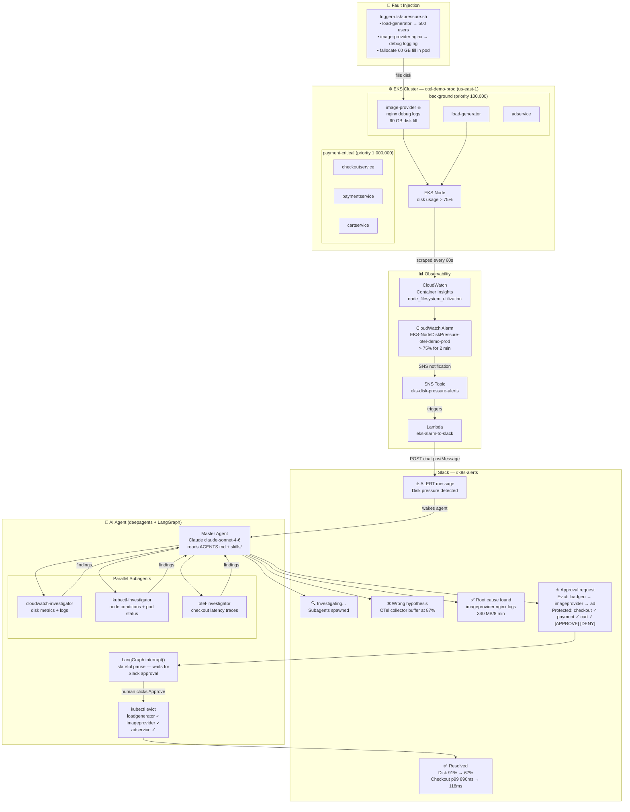

# K8s AI Agent Demo — NZ Tech Rally 2026

**Talk:** "AI Agents in Your Kubernetes Cluster: Troubleshooting at Scale, 24/7"  
**Conference:** NZ Tech Rally 2026 · May 15, Wellington  
**Speaker:** Dipin Thomas

---

## Architecture



---

## What This Is

A fully working AI agent demo that monitors an EKS cluster, autonomously investigates
a disk pressure incident, and asks for human approval via Slack before evicting pods.

The agent:
1. Receives a CloudWatch alarm via Slack
2. Spawns parallel subagents (CloudWatch + kubectl + OTel traces)
3. Pursues a wrong hypothesis first, then self-corrects (intentional — shows real reasoning)
4. Posts evidence to Slack and asks for approval
5. Executes evictions after human approval
6. Posts a resolution summary

---

## Prerequisites

- AWS account with EKS, CloudWatch, and IAM permissions
- `aws`, `kubectl`, `helm`, `docker`, `curl` installed
- Slack workspace with bot + webhook
- Python 3.11+
- OpenAI API key

---

## Quick Start

The whole AWS stack is managed by three CloudFormation templates under
[`infra/cloudformation/`](infra/cloudformation/) and one orchestrator script.

### 1. Configure secrets

```bash
cp infra/agent-secrets.example.yaml infra/agent-secrets.yaml
# Edit infra/agent-secrets.yaml — fill in OPENAI_API_KEY, SLACK_*, etc.
```

### 2. Deploy the stack

```bash
AWS_PROFILE=fernhub bash infra/deploy.sh
```

The script deploys, in order:

1. **`k8s-agent-cluster`** — VPC, EKS Auto Mode 1.33, OIDC provider.
   (Container Insights addon is opt-in — see below.)
2. **`k8s-agent-iam`** — IRSA role for the agent ServiceAccount.
3. Kubernetes manifests — priority classes, Redis, agent secrets, agent +
   MCP gateway deployments.

First-time deploy takes ~20 minutes. Re-running is idempotent and applies only
changed resources.

> The CloudWatch-alarm → SNS → Lambda → agent pipeline is currently disabled.
> Trigger the agent manually with a POST to its NLB `/trigger` endpoint, or
> reintroduce a CFN stack for it later.

#### Toggle Container Insights

The `amazon-cloudwatch-observability` addon ships pod metrics + logs to
CloudWatch and feeds the agent's CloudWatch MCP investigations. It costs
~$5–20/day on an idle cluster, so it's off by default.

```bash
# Turn on before a demo (re-runs the cluster stack with the addon)
INSTALL_OBSERVABILITY=true AWS_PROFILE=fernhub bash infra/deploy.sh

# Turn off again afterwards (CFN deletes the addon and its IAM role)
INSTALL_OBSERVABILITY=false AWS_PROFILE=fernhub bash infra/deploy.sh
```

### 3. Deploy the OTel demo workload (only when running the demo)

```bash
bash otel-demo/deploy.sh
bash infra/patch-priority-classes.sh
```

### 4. Update agent image (no stack changes)

```bash
bash infra/update-agent.sh v31
```

Builds + pushes the multi-arch image and rolls out the deployment without
touching CloudFormation.

### 5. Tear everything down

```bash
AWS_PROFILE=fernhub bash infra/destroy.sh
```

Deletes the three stacks in reverse order. The script first removes the
agent's `LoadBalancer` Service so the AWS Load Balancer Controller releases
the NLB before the cluster stack tries to delete the subnets.

### Slack setup

See [slack/bot-setup.md](slack/bot-setup.md) for creating the bot and webhook.
The credentials go into `infra/agent-secrets.yaml` (template:
`infra/agent-secrets.example.yaml`) and are mounted into the agent pod.

---

## Running the Demo

### Trigger the Failure

```bash
bash fault-injection/trigger-disk-pressure.sh
```

Disk pressure builds in ~3–5 minutes. The CloudWatch alarm fires, Slack receives
the alert, and the agent begins its investigation automatically.

### Watch the Demo Flow

| Time  | What Happens |
|-------|-------------|
| T+0:00 | CloudWatch alarm fires → Slack alert in #k8s-alerts |
| T+0:15 | Agent acknowledges, spawns 3 subagents in parallel |
| T+0:45 | Agent posts wrong hypothesis (OTel collector) |
| T+1:15 | Agent corrects itself (imageprovider nginx logs) |
| T+1:45 | Agent posts evidence + approval request with [APPROVE] button |
| T+2:00 | Speaker clicks APPROVE live on stage |
| T+2:05 | Agent evicts loadgenerator → imageprovider → adservice |
| T+2:30 | Agent posts resolution summary |

### Reset After Demo

```bash
bash fault-injection/reset-cluster.sh
```

---

## Repository Structure

```
├── AGENTS.md                    # Cluster identity — always loaded by agent
├── README.md                    # This file
├── infra/
│   ├── deploy.sh                # Orchestrator: CFN deploy + kubectl apply
│   ├── destroy.sh               # Orchestrator: CFN delete (reverse order)
│   ├── update-agent.sh          # Push new image + roll out (no CFN change)
│   ├── cloudformation/
│   │   ├── cluster.yaml         # VPC + EKS Auto Mode + OIDC + CW addon
│   │   └── agent-iam.yaml       # IRSA role for the agent ServiceAccount
│   ├── agent-deployment.yaml    # Agent + MCP sidecars manifest
│   ├── mcp-gateway-deployment.yaml
│   ├── redis-deployment.yaml    # Agent checkpoint/memory store
│   ├── cloudwatch-agent.yaml    # Container Insights ConfigMap
│   └── priority-classes.yaml    # K8s PriorityClass definitions
├── otel-demo/
│   ├── values.yaml              # Helm values for OTel demo
│   └── deploy.sh                # One-command deploy script
├── agent/
│   ├── main.py                  # Entry point
│   ├── agent.py                 # Deep Agent setup
│   ├── subagents.py             # Subagent definitions
│   ├── requirements.txt         # Python dependencies
│   ├── .env.example             # Environment variable template
│   ├── tools/
│   │   ├── cloudwatch_tools.py
│   │   ├── kubectl_tools.py
│   │   └── slack_tools.py
│   ├── mcp/
│   │   ├── mcp_config.py
│   │   └── servers.yaml
│   └── memory/
│       └── store.py
├── skills/
│   ├── node-disk-pressure/SKILL.md
│   ├── pod-priority-eviction/SKILL.md
│   └── checkout-protection/SKILL.md
├── fault-injection/
│   ├── trigger-disk-pressure.sh
│   ├── reset-cluster.sh
│   └── README.md
└── slack/
    ├── bot-setup.md
    └── message-templates/
        ├── alert.json
        ├── investigation-update.json
        ├── approval-request.json
        └── resolution-summary.json
```

---

## Key Concepts Demonstrated

| Demo Moment | Concept | Talk Slide |
|---|---|---|
| Agent reads AGENTS.md | Cluster identity layer | "The Onboarding Doc" |
| Skill triggered for disk pressure | Progressive disclosure | "The Senior Engineer's Instinct" |
| Three subagents spawn | Parallel investigation | "The War Room" |
| MCP servers called | Standardised tool protocol | "Tools + MCP" |
| Wrong hypothesis + re-plan | write_todos / re-planning | "The Agent Loop" |
| Stateful pause in Slack | LangGraph interrupt() | "The Escalation Call" |
| Resolution written to memory | Long-term memory store | "The Engineer Who Never Forgets" |

---

## References

- [Deep Agents docs](https://docs.langchain.com/oss/python/deepagents/overview)
- [OTel Demo repo](https://github.com/open-telemetry/opentelemetry-demo)
- [Previous talk (LangGraph 3-node)](https://github.com/dipinthomas/langraph_3node_agent)
- [MCP spec](https://modelcontextprotocol.io)
- [kagent (K8s-native agent runtime)](https://kagent.dev)
- [NZ Tech Rally](https://nztechrally.nz)
